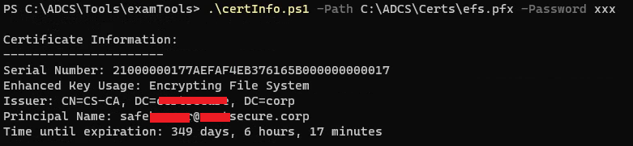
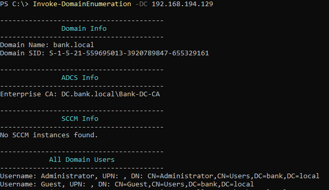
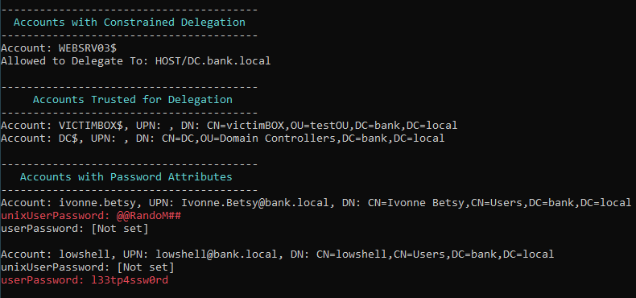
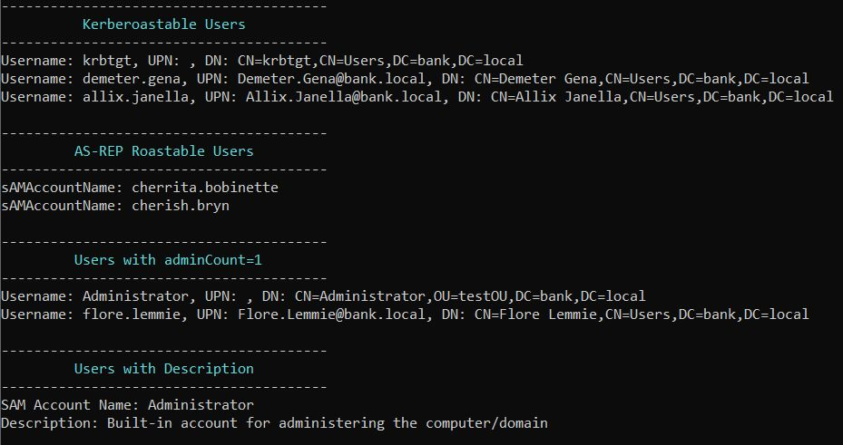
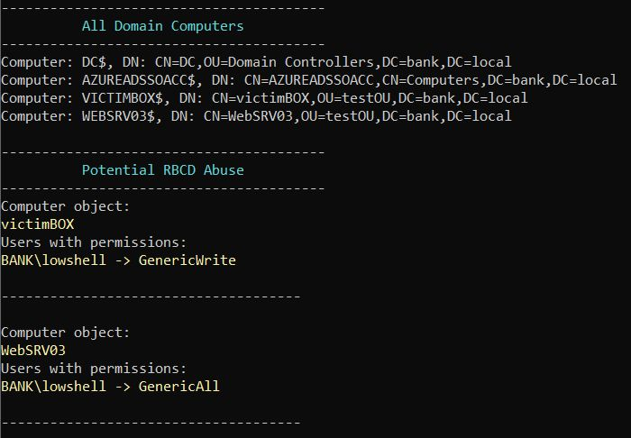
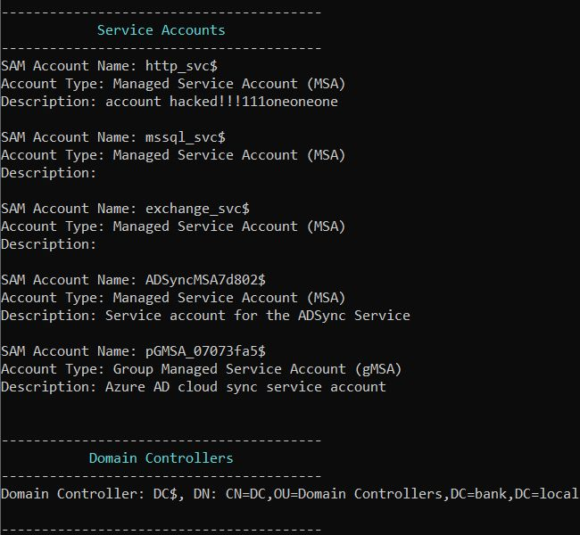
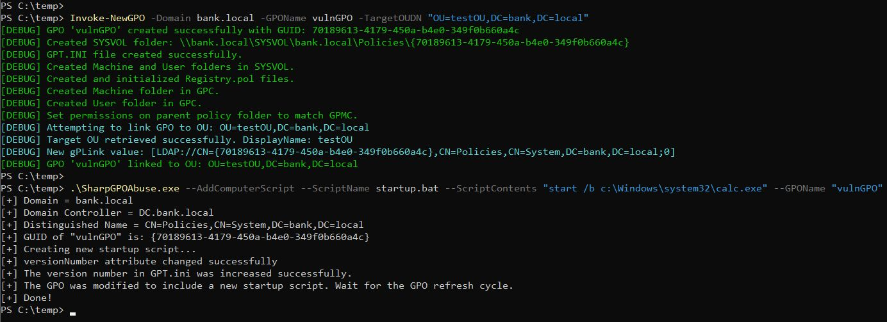
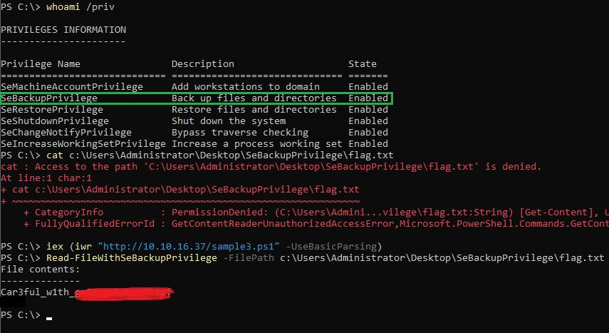
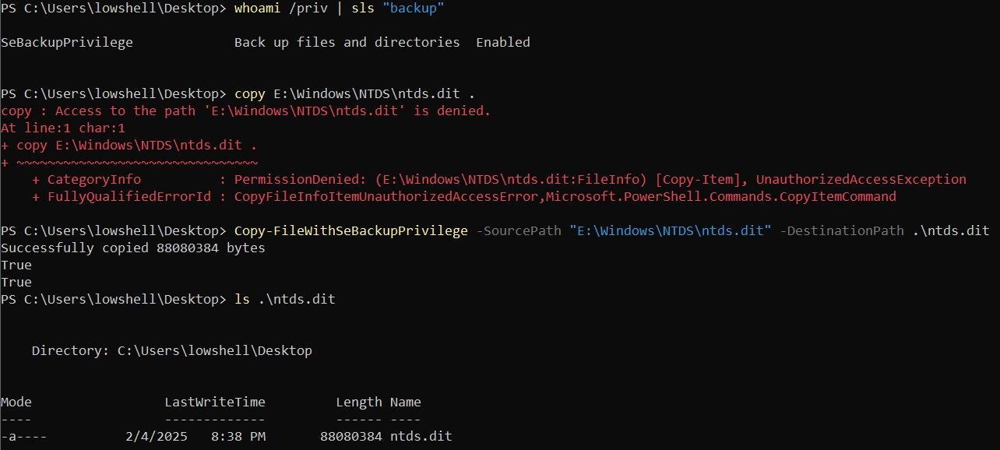
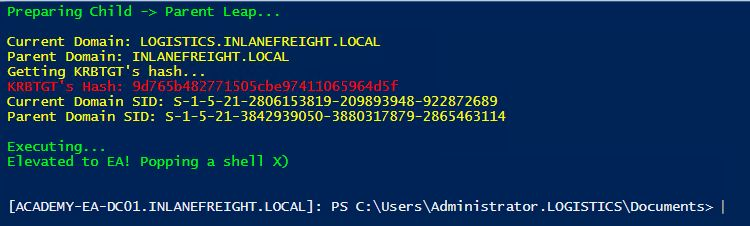

# CTF Toolbox

PowerShell & Python tools developed for CTFs and certification exams.

---

**certInfo.ps1**: Displays information about a cert file

---

**Invoke-DomainEnumeration.(ps1|py)**: Domain enumeration in PS & Python. PS version works without any extra modules, Python version needs LDAP3.\
(Only the PS version will display potential RBCD abuse, parsing ACLs in python was a royal pain in the ass.)

---

**Invoke-NewGPO.ps1**: Creates a new empty GPO and links it to the target OU, assuming you have enough privileges. (works like a charm with membership in `Group Policy Creator Owners` or anything equally powerful).
Keep in mind that you still need privilege to link the GPO. Linking GPOs is an OU-specific permission, creating GPOs is a domain wide permission.

---

**Read-FileWithSeBackupPrivilege**: Uses SeBackupPrivilege to read files/flags.

---

**Copy-FileWithSeBackupPrivilege**: Uses SeBackupPrivilege to copy files.

---

**raiseChild.ps1**: PowerShell version of Impacket's `raiseChild.py` - automates Child domain --> Parent domain compromise.

