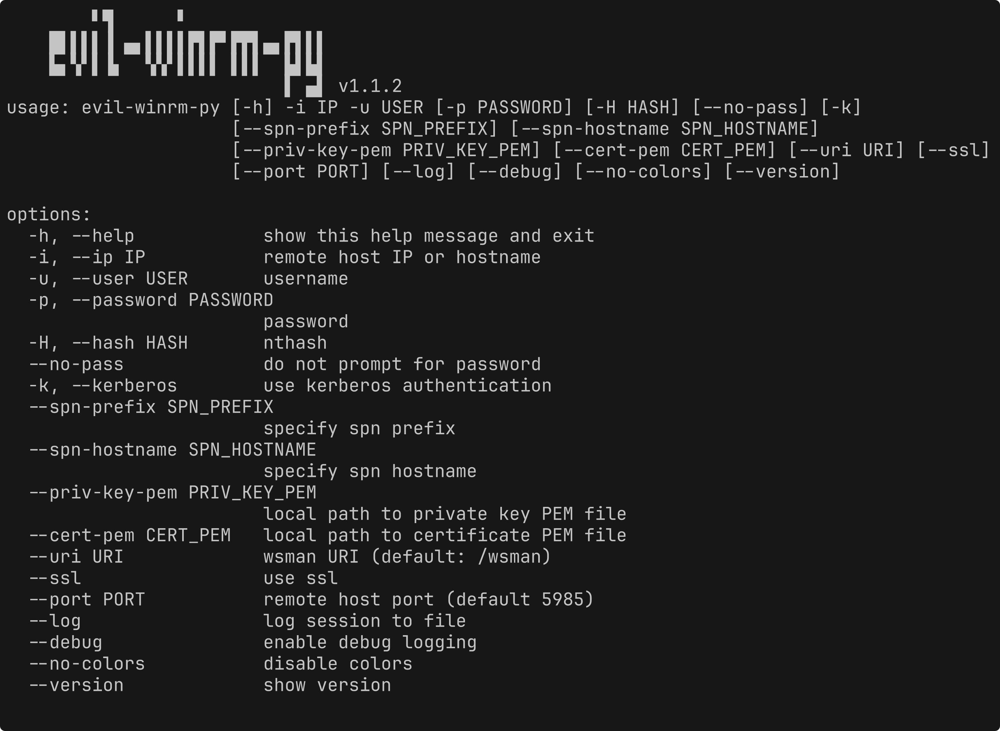

# evil-winrm-py

`evil-winrm-py` is a python-based tool for executing commands on remote Windows machines using the WinRM (Windows Remote Management) protocol. It provides an interactive shell with enhanced features like file upload/download, command history, and colorized output. It supports various authentication methods including NTLM, Pass-the-Hash, Certificate, and Kerberos.



> [!NOTE]
> This tool is designed strictly for educational, ethical use, and authorized penetration testing. Always ensure you have explicit authorization before accessing any system. Unauthorized access or misuse of this tool is both illegal and unethical.

## Motivation

The original evil-winrm is written in Ruby, which can be a hurdle for some users. Rewriting it in Python makes it more accessible and easier to use, while also allowing us to leverage Python’s rich ecosystem for added features and flexibility.

I also wanted to learn more about winrm and its internals, so this project will also serve as a learning experience for me.

## Features

- Execute commands on remote Windows machines via an interactive shell.
- Support for NTLM authentication.
- Support for Pass-the-Hash authentication.
- Support for Certificate authentication.
- Support for Kerberos authentication with SPN (Service Principal Name) prefix and hostname options.
- Support for SSL to secure communication with the remote host.
- Support for custom WSMan URIs.
- Download files from the remote host to the local machine.
- Upload files from the local machine to the remote host.
- Auto-complete local and remote file paths with tab completion.
- Support for paths with spaces using quotes.
- Enable logging and debugging for better traceability.
- Navigate command history using up/down arrow keys.
- Display colorized output for improved readability..
- Lightweight and Python-based for ease of use.
- Keyboard Interrupt (Ctrl+C) support to terminate long-running commands gracefully.

Detailed documentation can be found in the [docs](./docs/) directory.

## Installation (Windows/Linux)

#### Installation of Kerberos prerequisites on Linux

```bash
sudo apt install gcc python3-dev libkrb5-dev krb5-pkinit
# Optional: krb5-user
```

### Install `evil-winrm-py`

> You may use [pipx](https://pipx.pypa.io/stable/) or [uv](https://docs.astral.sh/uv/) instead of pip to install evil-winrm-py. `pipx`/`uv` is a tool to install and run Python applications in isolated environments, which helps prevent dependency conflicts by keeping the tool's dependencies separate from your system's Python packages.

```bash
pip install evil-winrm-py
pip install evil-winrm-py[kerberos] # for kerberos support on Linux
```

or if you want to install with latest commit from the main branch you can do so by cloning the repository and installing it with `pip`/`pipx`/`uv`:

```bash
git clone https://github.com/kraloveckey/mini-python
cd mini-python/evil-winrm-py
pip install .
```

### Update

```bash
pip install --upgrade evil-winrm-py
```

### Uninstall

```bash
pip uninstall evil-winrm-py
```

## Usage

Details on how to use `evil-winrm-py` can be found in the [Usage Guide](./docs/usage.md).

```bash
usage: evil-winrm-py [-h] -i IP -u USER [-p PASSWORD] [-H HASH] [--no-pass] [-k]
                     [--spn-prefix SPN_PREFIX] [--spn-hostname SPN_HOSTNAME]
                     [--priv-key-pem PRIV_KEY_PEM] [--cert-pem CERT_PEM] [--uri URI] [--ssl]
                     [--port PORT] [--log] [--debug] [--no-colors] [--version]

options:
  -h, --help            show this help message and exit
  -i IP, --ip IP        remote host IP or hostname
  -u USER, --user USER  username
  -p PASSWORD, --password PASSWORD
                        password
  -H HASH, --hash HASH  nthash
  --no-pass             do not prompt for password
  -k, --kerberos        use kerberos authentication
  --spn-prefix SPN_PREFIX
                        specify spn prefix
  --spn-hostname SPN_HOSTNAME
                        specify spn hostname
  --priv-key-pem PRIV_KEY_PEM
                        local path to private key PEM file
  --cert-pem CERT_PEM   local path to certificate PEM file
  --uri URI             wsman URI (default: /wsman)
  --ssl                 use ssl
  --port PORT           remote host port (default 5985)
  --log                 log session to file
  --debug               enable debug logging
  --no-colors           disable colors
  --version             show version
```

Example:

```bash
evil-winrm-py -i 192.168.1.100 -u Administrator -p P@ssw0rd --ssl
```

## Menu Commands (inside evil-winrm-py shell)

```bash
Menu:
[+] upload <local_path> <remote_path>                       - Upload a file
[+] download <remote_path> <local_path>                     - Download a file
[+] menu                                                    - Show this menu
[+] clear, cls                                              - Clear the screen
[+] exit                                                    - Exit the shell
Note: Use absolute paths for upload/download for reliability.
```